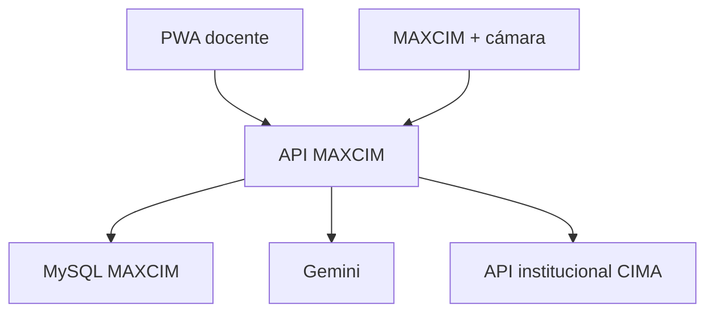

# MAXCIM App · Producción

Aplicación web instalable para docentes del Colegio CIMA. Trabaja exclusivamente con identidades, aulas y matrículas obtenidas de la API institucional; no incluye registros de ejemplo ni un modo de simulación.

La estudiante o el estudiante conversa oralmente con MAXCIM. La docente utiliza esta consola desde iPhone, iPad, Android, Windows o macOS.

## Capacidades conservadas

1. La docente inicia sesión con su identidad institucional.
2. La aplicación carga únicamente las aulas asignadas por la API del colegio.
3. La docente sube un documento o crea un cuento con las elecciones del alumno y elige una duración de 1 a 15 minutos.
4. Gemini ajusta la extensión, narra el cuento completo con ritmo adaptativo, genera el resumen y propone preguntas con respuestas esperadas.
5. La docente edita y aprueba el contenido antes de guardarlo.
6. MAXCIM recibe el cuento aprobado, lo narra y realiza las preguntas.
7. El servicio facial envía el ID detectado; el backend vuelve a consultar la API institucional y valida identidad, estado y matrícula activa.
8. MAXCIM registra los turnos orales y la aplicación calcula la evaluación.
9. La docente corrige los porcentajes, escribe observaciones y aprueba el resultado final.



## Comportamiento seguro

- Si la API institucional no está configurada o no responde, la aplicación muestra un estado de conexión y no inventa datos.
- La contraseña institucional no se almacena.
- El token de la docente queda cifrado en MySQL; la cookie contiene solamente un UUID opaco.
- El evento facial solo aporta `person_id` y confianza. Nombre, rol y aulas se vuelven a consultar en la fuente institucional.
- No se almacenan fotografías, embeddings ni plantillas biométricas.
- Todas las llamadas del robot exigen `X-MAXCIM-Webhook-Secret`.
- Materiales, sesiones y evaluaciones se filtran por el ID de la docente autenticada.

## Preparación local

Requisitos: Python 3.11+, MySQL 8, acceso autorizado a la API institucional y una clave de Gemini.

```bash
python -m venv .venv
source .venv/bin/activate
pip install -r requirements-dev.txt
cp .env.example .env
```

En Windows PowerShell, la activación es `.venv\Scripts\Activate.ps1`.

Crear la base y aplicar migraciones:

```bash
mysql -u root -p < bd_app.sql
mysql -u root -p maxcim_app < migrations/001_interacciones.sql
mysql -u root -p maxcim_app < migrations/002_sesiones_web.sql
mysql -u root -p maxcim_app < migrations/003_duracion_audio.sql
```

Configurar los secretos en `.env` y ejecutar:

```bash
python app.py
```

## Despliegue web real

GitHub Pages no puede ejecutar esta aplicación porque solo publica sitios
estáticos y MAXCIM utiliza Python, MySQL y APIs del servidor. El repositorio
incluye un `Dockerfile` listo para desplegarse como servicio web en Railway:

1. Crear un proyecto en Railway desde el repositorio de GitHub.
2. Agregar un servicio MySQL al mismo proyecto.
3. Crear en el servicio web `DATABASE_URL=${{MySQL.MYSQL_URL}}`. Si el servicio
   tiene otro nombre, reemplazar `MySQL` por ese nombre. También se pueden usar
   por separado `MYSQL_HOST`, `MYSQL_PORT`, `MYSQL_USER`, `MYSQL_PASSWORD` y
   `MYSQL_DATABASE`.
4. Agregar las demás variables privadas descritas abajo.
5. Generar el dominio público desde `Settings > Networking`.
6. Para conservar audios entre despliegues, montar un volumen persistente en
   `/app/static/uploads`.

El contenedor crea las tablas faltantes de una base nueva antes de iniciar
Gunicorn y publica `GET /health` para comprobar el estado del servicio. Si la API
institucional solo existe dentro de la red del colegio, será necesario exponerla
de forma segura por HTTPS o conectar el alojamiento a esa red privada.

## Variables obligatorias

| Variable | Uso |
|---|---|
| `SECRET_KEY` | Firma la cookie opaca de sesión |
| `SESSION_TOKEN_ENCRYPTION_KEY` | Cifra el token institucional almacenado en MySQL |
| `MYSQL_*` | Conexión a la base propia de MAXCIM |
| `INSTITUTIONAL_API_BASE_URL` | URL autorizada de la API principal |
| `INSTITUTIONAL_API_LOGIN_PATH` | Inicio de sesión docente |
| `INSTITUTIONAL_API_CLASSROOMS_PATH` | Aulas de la docente autenticada |
| `INSTITUTIONAL_API_STUDENT_PATH` | Perfil y matrículas del ID reconocido |
| `INSTITUTIONAL_API_SERVICE_TOKEN` | Credencial servidor-a-servidor para validación facial |
| `GOOGLE_API_KEY` | Cuentos, resumen, preguntas, evaluación y narración TTS |
| `MAXCIM_WEBHOOK_SECRET` | Autentica a MAXCIM y al servicio facial |
| `FACE_MATCH_MIN_CONFIDENCE` | Umbral mínimo de reconocimiento |
| `SESSION_COOKIE_SECURE` | Debe permanecer `true` bajo HTTPS |

## Endpoints del robot

| Método y ruta | Finalidad |
|---|---|
| `GET /api/materials?teacher_id={id}` | Listar materiales reales de una docente |
| `GET /api/materials/{id}` | Obtener un material aprobado |
| `POST /api/integrations/face-recognition/events` | Validar el ID reconocido y asociarlo a la sesión |
| `GET /api/interactions/sessions/{uuid}/robot-payload` | Obtener objetivo, audio, texto y preguntas aprobadas |
| `POST /api/interactions/sessions/{uuid}/turns` | Registrar un turno oral |
| `POST /api/interactions/sessions/{uuid}/complete` | Cerrar la conversación y preparar la evaluación |

El contrato de la API institucional y del robot está en [docs/integration-contract.md](docs/integration-contract.md).

## Base de datos

La base institucional sigue siendo la fuente de verdad. La base propia de MAXCIM guarda solamente:

- materiales, preguntas aprobadas y duración real medida del audio;
- sesiones e IDs institucionales de referencia;
- transcripciones, tiempos y evidencias;
- porcentajes y revisión docente;
- sesiones web cifradas y revocables.

## Pruebas

```bash
pytest -q
```

Las pruebas automatizadas usan dobles aislados dentro del entorno de test. Esos datos nunca se cargan en la aplicación ni en la base de producción.

## Estado de la integración

El código de producción queda bloqueado de forma segura hasta recibir la autorización, URL y respuestas reales de la API institucional. Cuando se entregue el Swagger/OpenAPI o JSON anonimizado, se ajustará `services/institutional.py` al contrato oficial sin cambiar las pantallas ni el flujo del robot.
